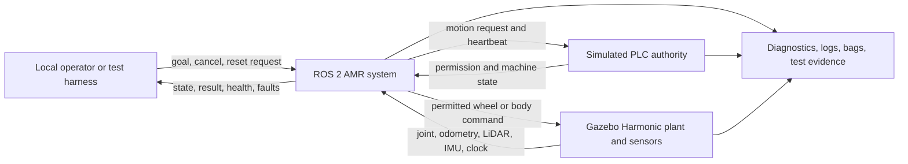
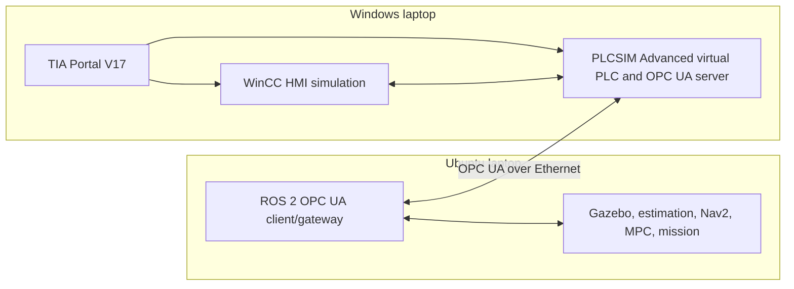
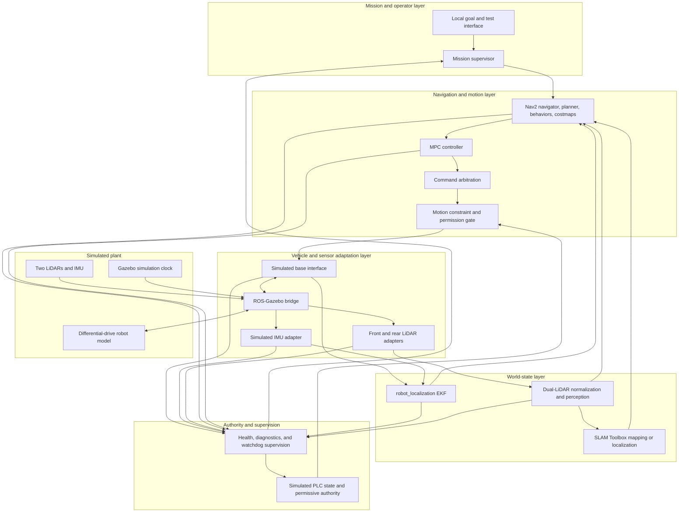

# Phase 1 Final System Architecture

## Purpose

This document defines the final logical architecture for the simulation-only
academic AMR. It establishes component responsibilities, authority boundaries,
data and command flows, lifecycle order, failure containment, and ownership by
later phases.

Phase 1 does not create ROS 2 packages, executable nodes, URDF/Xacro, electrical
design, network configuration, controller code, or PLC logic. Exact topic
names, message definitions, QoS, update rates, package names, process
composition, and solver selections remain assigned to their later phases.

## Governing Baseline

The architecture inherits these approved Phase 0 constraints:

- one differential-drive AMR running entirely in laptop simulation;
- ROS 2 Humble on Ubuntu 22.04 with C++17 minimum;
- Gazebo Harmonic as the plant and sensor simulator;
- two simulated SICK MRS1104C-111011 perception sensors;
- one simulated IMU using Xsens MTi-8 characteristics as a reference;
- wheel odometry plus `robot_localization` EKF;
- SLAM Toolbox for mapping/localization;
- Nav2 for mission navigation, planning, behaviors, and costmaps;
- one MPC local motion controller;
- a simulated Siemens S7-1500F PLC through PLCSIM Advanced;
- Siemens S7-1200F retained only as a conceptual future physical candidate;
- Siemens TIA Portal V17 as the PLC and HMI engineering environment;
- no outdoorScan3 and no safety-rated perception claim;
- 50 kg default simulated payload and approximately 80 kg nominal initial
  moving mass;
- user ownership of all mechanical CAD.

The detailed inputs and unresolved values remain in
[`ROBOT_PARAMETER_REGISTER.md`](ROBOT_PARAMETER_REGISTER.md).

## Architecture Principles

1. **One owner per authority.** Each command, state, and TF transform has one
   authoritative publisher at a time.
2. **PLC permission is final.** ROS may request motion; only the simulated PLC
   authority may grant or remove drive permission.
3. **All motion paths pass through one gate.** Navigation, test, and future
   manual commands cannot bypass command arbitration, motion limits, permission
   checks, and timeout handling.
4. **Simulation time is authoritative.** Gazebo publishes `/clock`; every
   time-dependent ROS component uses simulation time while the simulated system
   is active.
5. **Perception is operational, not safety-rated.** LiDAR and costmap results
   support navigation but receive no functional-safety credit.
6. **Replaceable lower boundary.** Gazebo adapters expose the same logical
   vehicle and sensor contracts that future physical drivers would need, but
   no physical driver is required in the current project.
7. **Fail inhibited.** Missing, stale, contradictory, or invalid permission,
   command, clock, localization, or critical health state prevents motion.
8. **No hidden implementation decisions.** Later-phase details remain explicit
   open items instead of being silently fixed in this architecture.

## System Context



ROS 2 and Gazebo run on the Ubuntu laptop. TIA Portal V17, PLC simulation, and
HMI simulation run on a second Windows laptop. The laptops communicate over
Ethernet using an OPC UA contract. The Jetson, physical PLC, motor driver,
motors, managed network equipment, battery, HMI panel, and sensors remain
conceptual future references and are not deployment dependencies.

## Simulation Substitution Map

| Conceptual future physical element | Current simulation representation |
|---|---|
| Jetson Orin Nano | Ubuntu laptop running the complete ROS 2 graph |
| Siemens S7-1500F virtual PLC | TIA Portal V17 PLC project plus PLCSIM Advanced runtime and OPC UA server |
| Siemens S7-1200F and fail-safe I/O in the BOM | Conceptual future physical candidate only; not the current simulated PLC |
| ZLAC8030D and two hub motors | Simulated base interface and Gazebo differential-drive plant |
| Two SICK MRS1104C-111011 units | Two independently named Gazebo LiDAR sensors |
| Xsens MTi-8 | Gazebo IMU plus a ROS sensor adapter |
| SCALANCE switch, PCAN interface, and field wiring | Logical ROS/Gazebo transport and later fault-injection boundaries |
| Battery, BMS, contactors, and protection | Later simulated energy, permission, feedback, and fault states |
| KTP700 Basic PN candidate | TIA Portal V17 HMI project plus a simulated HMI/runtime |

The substitution preserves responsibility and information boundaries without
claiming electrical, timing, failure-mode, or safety equivalence. Physical
ordering codes remain in the conceptual BOM but do not authorize drivers,
procurement, or commissioning.

## TIA Portal V17 Toolchain Boundary

TIA Portal V17 is the fixed engineering environment for both the PLC and HMI
parts of the project on the Windows laptop. It owns:

- PLC hardware configuration and PLC program engineering;
- fail-safe program engineering when the selected STEP 7 Safety license and
  simulated CPU configuration support it;
- HMI screen, alarm, tag, and operator-interaction engineering;
- compilation and download to the selected Siemens simulation runtimes.

TIA Portal does not own ROS navigation, motion control, localization,
perception, or the Gazebo plant. The HMI may request missions, stops, resets, or
mode changes through the PLC/ROS contract, but it may not publish directly to
the motion-command path or force a permissive PLC state.

Siemens' V17 installation documentation identifies Windows operating systems,
not Ubuntu, for TIA Portal V17. The project therefore uses two computers:

- Ubuntu laptop: ROS 2, Gazebo, RViz, MPC, navigation, perception, and AMR
  development;
- Windows laptop: TIA Portal V17, PLC simulation, and HMI simulation;
- inter-laptop link: Ethernet carrying OPC UA application traffic.

This arrangement permits simultaneous PLC/HMI and ROS/Gazebo execution without
repartitioning or virtualizing the Ubuntu development laptop.

The following are not implied by the phrase “TIA Portal V17” and remain open:

- exact TIA Portal V17 update level;
- STEP 7 Basic or Professional and the required Safety option/license;
- exact S7-PLCSIM Advanced version and update compatible with TIA Portal V17;
- exact simulated S7-1500F CPU model and firmware target;
- WinCC V17 Basic, Comfort, Advanced, Professional, or Unified edition;
- HMI runtime/simulator and panel-image versions;
- OPC UA namespace, endpoint, certificates, authentication, data contract,
  heartbeat, timeout, and reconnect behavior.

Siemens' PLCSIM Advanced documentation states that PLCSIM Advanced supports
S7-1500-class virtual CPUs and OPC UA but does not simulate S7-1200 CPUs. The
user therefore selected S7-1500F as the current simulated PLC family. PLCSIM
Advanced V4.0 is the provisional TIA Portal V17-compatible simulation target;
its installed version/update and the exact S7-1500F model/firmware must be
verified before implementation.

The BOM's S7-1200F remains a conceptual future physical candidate only. No
equivalence or automatic portability is claimed between the S7-1500F
simulation project and a future S7-1200F implementation. A future physical
project would require an explicit porting and revalidation plan.

Official references:

- [TIA Portal V17 STEP 7 / WinCC installation notes](https://support.industry.siemens.com/cs/attachments/109792165/Install_STEP7_WinCC_V17_enUS.pdf)
- [S7-PLCSIM V17 readme](https://support.industry.siemens.com/cs/attachments/109784440/ReadMe_PLCSIM_enUS.pdf)
- [S7-PLCSIM Advanced CPU support and restrictions](https://support.industry.siemens.com/cs/attachments/109977691/s7-plcsim_advanced_function_manual_en-US_en-US.pdf)

## Two-Laptop OPC UA Boundary



The OPC UA endpoint role is provisionally fixed as:

- PLCSIM Advanced virtual PLC: OPC UA server;
- Ubuntu ROS 2 gateway: OPC UA client;
- WinCC HMI simulation: Siemens HMI-to-PLC connection within the Windows
  environment unless Phase 3 explicitly selects OPC UA for that link.

The ROS gateway may read machine state and write defined request variables. It
must not write authoritative PLC outputs, bypass PLC logic, clear latched
faults directly, or treat OPC UA as a safety-rated or deterministic fieldbus.
The Phase 3 contract will define certificates, trust, namespace, data types,
ownership, freshness, heartbeat, reconnect, and command acknowledgement.

## Layered Logical Architecture



The diagram shows logical ownership, not final ROS node or process boundaries.
Phase 4 will choose packages, executables, lifecycle-node use, and composition.

## Component Responsibilities

| Component | Owns | Must not own |
|---|---|---|
| Gazebo plant | Physics, contact, joint dynamics, simulated sensor generation, simulation clock | Navigation decisions, PLC permission, map state |
| ROS-Gazebo bridge | Typed transport between Gazebo and ROS 2 | Data fusion, control policy, safety decisions |
| Simulated base interface | Command translation, wheel/body feedback normalization, command timeout, base health | Mission decisions, localization, final drive permission |
| Sensor adapters | Per-sensor naming, timestamps, frames, units, status, and normalized ROS messages | Cross-sensor fusion or personnel-safety decisions |
| EKF | Continuous local `odom` estimate from wheel odometry and IMU | Global `map` correction or command generation |
| SLAM Toolbox | Map creation/localization and the global-to-local frame relationship | Wheel odometry, motion permission |
| Dual-LiDAR perception | Per-sensor validation, projection/aggregation needed by SLAM and costmaps, operational obstacle data | Safety-rated protective fields |
| Nav2 | Goal execution, global planning, behaviors, costmaps, recovery orchestration | Final permission or low-level wheel control |
| MPC controller | Local path tracking subject to approved kinematic and motion constraints | Bypassing Nav2 lifecycle, permission gate, or command timeout |
| Command arbitration | Select exactly one authorized motion-request source | Grant drive permission |
| Motion gate | Enforce permission, freshness, finite values, and approved motion limits; output zero/inhibit when invalid | Decide mission goals or reset safety faults |
| Mission supervisor | Goal/cancel coordination, mission state, readiness checks, result reporting | Direct actuator commands |
| Simulated PLC authority | Drive permission, stopped/fault/E-stop state, reset prerequisites, heartbeat supervision | SLAM, path planning, perception |
| TIA Portal V17 engineering projects | PLC logic, fail-safe project configuration, HMI screens, tags, alarms, and compiled Siemens artifacts | ROS navigation, direct base commands, bypass of PLC authority |
| Simulated HMI | Operator mission/mode/stop/reset requests and machine/mission status display through approved interfaces | Direct wheel/body commands or direct permission forcing |
| Health supervision | Aggregate freshness, lifecycle, diagnostics, and fault evidence | Override PLC authority |
| Evidence pipeline | Timestamped diagnostics, state transitions, bags, metrics, and test results | Control authority |

## Control and Authority Path

The only valid motion-command path is:

```text
mission goal
  -> Nav2
  -> MPC motion request
  -> command arbitration
  -> motion constraint and permission gate
  -> simulated base interface
  -> Gazebo differential-drive plant
```

Test or future manual motion sources enter at command arbitration and follow the
same downstream path. No source may publish directly to the base interface.

The gate permits a nonzero command only when all of the following are true:

- the simulated PLC state explicitly grants drive permission;
- the selected command source is authorized and unique;
- the command and required state inputs are fresh;
- values are finite and within the approved speed, acceleration, deceleration,
  and jerk envelope;
- base, estimator, navigation, and clock health meet the active-mode policy;
- no active E-stop, stop request, latched fault, or shutdown transition exists.

The detailed protocol, heartbeat period, state-machine transitions, reset
rules, and cause/effect matrix are deferred to Phases 3 and 12. The gate's
fail-inhibited behavior is fixed here.

## State-Estimation and TF Contract

The architecture uses the standard two-frame localization pattern:

```text
map -> odom -> base_footprint -> base_link -> sensor and running-gear frames
```

Authoritative ownership is:

| Transform or state | Authority |
|---|---|
| `map -> odom` | SLAM Toolbox in the selected mapping/localization mode |
| `odom -> base_footprint` | EKF output |
| `base_footprint -> base_link` | Robot description / state publication contract |
| `base_link -> fixed sensor frames` | Robot description |
| Running-gear joint transforms | Robot state publication from joint state |

The base interface provides wheel odometry and joint feedback. The IMU adapter
provides inertial measurements. The EKF produces the continuous local state
used by Nav2 and MPC. SLAM Toolbox supplies global correction without replacing
the local odometry authority.

Phase 3 will freeze message/QoS contracts. Phase 6 will freeze static geometry
and frames. Phase 7 will freeze EKF state variables, covariances, rates, and
transform publication details. No later component may publish a duplicate
authoritative transform.

## Perception Flow

Each simulated LiDAR remains independently identifiable from source to health
report:

```text
Gazebo front LiDAR -> front adapter -> front normalized stream --+
                                                               +-> projection/
Gazebo rear LiDAR  -> rear adapter  -> rear normalized stream  --+   aggregation
                                                                    |-> SLAM input
                                                                    `-> Nav2 costmaps
```

Phase 8 will select the exact LaserScan/PointCloud2 projection, aggregation,
filtering, overlap, occlusion, and dropout policy. The architecture requires:

- unique front and rear frames and namespaces;
- source timestamps based on simulation time;
- independent health and freshness reporting;
- no silent substitution of one sensor for the other;
- an explicit degraded-mode decision before motion with a missing sensor;
- preserved raw or minimally processed streams for validation;
- no functional-safety credit for any output.

The default failure policy is motion inhibition when a required perception
input is unavailable. A less restrictive degraded mode requires later explicit
approval and test evidence.

## Navigation and Mission Flow

The initial mission contract is:

1. a local operator or test harness submits a goal;
2. the mission supervisor confirms system readiness;
3. Nav2 plans and executes the goal;
4. the MPC controller generates constrained local motion requests;
5. the command gate permits or suppresses motion according to PLC and health
   state;
6. mission progress, completion, cancellation, recovery, and failure are
   reported and logged;
7. canceled, blocked, failed, or communication-loss cases end in a defined
   stopped or recoverable state.

There is one active local controller: MPC. Other installed Nav2 controllers,
including MPPI, may be used only as test references after explicit approval;
they are not automatic runtime fallbacks.

Fleet, WMS, MES, REST, MQTT, OPC UA, and VDA 5050 integration are outside the
initial runtime. A future external adapter may submit the same mission contract
without entering the motion-command path directly.

## Simulated PLC Boundary

The simulated PLC authority models architecture and state behavior only.

It receives logical inputs for:

- ROS heartbeat and software readiness;
- motion-enable request;
- reset request;
- simulated E-stop, bumper, contactor, drive, and power feedback;
- critical watchdog and base fault indications.

It publishes authoritative:

- drive permission;
- machine mode and stopped state;
- E-stop and protective-stop state;
- latched fault and reset eligibility;
- simulated contactor/drive-enable state;
- watchdog status.

ROS consumes these states but cannot force them to a permissive value. Reset is
a request evaluated by the simulated PLC logic, not a direct fault-clear
command.

This boundary makes no PL, SIL, Category, stopping-distance, or physical
suitability claim.

## Time, Naming, and Configuration Boundaries

- Gazebo `/clock` is the only time authority during simulation.
- All participating ROS components use `use_sim_time=true`.
- Data with absent, future, non-monotonic, or stale timestamps is rejected or
  faults according to the Phase 3 contract.
- The front and rear LiDARs remain separate logical devices.
- Frame names frozen in Phase 0 are retained.
- Exact ROS namespaces, topic/service/action names, QoS, queue depths, rates,
  timeout values, and parameter-file layout are Phase 3 and Phase 4 outputs.
- Configuration values have one declared source and are not duplicated across
  packages without an explicit derivation.
- Hardware-dependent values continue to require the Phase 0 evidence gate.

## Deployment Architecture

The deployment uses two laptops connected by Ethernet:

| Host | Runtime group | Required | Notes |
|---|---|---|---|
| Ubuntu laptop | Gazebo server | Yes | Authoritative plant, sensors, and clock |
| Ubuntu laptop | ROS-Gazebo bridge | Yes | Explicit Humble/Harmonic packages already validated |
| Ubuntu laptop | Core AMR ROS graph | Yes | Interfaces, estimation, perception, Nav2, MPC, mission, OPC UA gateway |
| Ubuntu laptop | RViz and Gazebo GUI | Optional | Development visualization; headless tests remain required |
| Windows laptop | TIA Portal V17 engineering | Yes | PLC and HMI project source |
| Windows laptop | Siemens PLC simulation | Yes for PLC integration tests | S7-1500F through PLCSIM Advanced V4.0 provisional pairing; exact CPU and installed update TBD |
| Windows laptop | Siemens HMI simulation | Yes for HMI integration tests | Exact WinCC V17 edition and runtime/simulator TBD |
| Both | Ethernet OPC UA link | Yes for integration tests | Isolated network, endpoint, certificates, and timing contract defined in Phase 3 |
| Both | Test/evidence tools | As required | Correlated logs, state transitions, metrics, and reports |

Development may use separate processes for fault isolation. Phase 4 may use
composition where it has a measured benefit, while keeping the authority and
failure boundaries in this document. GUI processes are never required for
headless acceptance tests.

## Lifecycle and Startup Order

Startup is staged:

1. start Gazebo server and verify a progressing simulation clock;
2. load the robot model and ROS-Gazebo bridges;
3. start the simulated PLC authority and motion gate in the inhibited state;
4. start base and sensor adapters;
5. establish robot state publication and the required TF tree;
6. start wheel odometry, IMU processing, and EKF;
7. start dual-LiDAR perception;
8. start SLAM Toolbox in the selected mode;
9. start Nav2 and MPC;
10. start mission supervision, health aggregation, and evidence collection;
11. grant readiness only after lifecycle, freshness, TF, clock, and fault
    checks pass;
12. allow the simulated PLC to grant drive permission according to its state
    rules.

Shutdown first inhibits the motion gate and confirms zero command, then
deactivates mission/navigation, perception/estimation, adapters/bridges, and
finally Gazebo. Restarting a component does not implicitly restore drive
permission or clear a latched fault.

## Failure Containment

| Condition | Required architectural response |
|---|---|
| PLC permission absent, stale, or contradictory | Immediately inhibit nonzero motion |
| Motion command stale, invalid, or non-finite | Output zero/inhibit and diagnose source |
| Gazebo clock absent or stalled | Inhibit motion and suspend time-dependent execution |
| Base feedback or bridge lost | Inhibit motion and fault the active mission |
| EKF invalid or local pose stale | Request a controlled stop only while required state remains valid; otherwise inhibit immediately |
| Global localization invalid | Cancel/pause the mission, request a controlled stop using valid local state, and enter a stopped recoverable state |
| Required LiDAR missing or stale | Default to inhibited motion; no unapproved degraded mode |
| MPC or Nav2 lifecycle failure | Command timeout produces zero; mission fails diagnostically |
| Mission supervisor restart | No automatic motion or goal replay |
| Simulated E-stop or latched PLC fault | Inhibit motion until PLC-side reset conditions pass |
| Logging/visualization failure | Diagnose; motion policy depends on whether evidence is required by the active test |

Exact detection periods and response deadlines are assigned to later phases.
These responses define direction and authority, not validated stopping
performance.

## Verification and Observability

Every acceptance run shall be able to reconstruct:

- software and configuration versions;
- simulation seed and payload selection;
- lifecycle transitions;
- mission goals, feedback, cancellations, and results;
- PLC state, permission, reset, and fault transitions;
- selected command source, requested command, gated command, and base feedback;
- TF and localization health;
- front and rear LiDAR freshness and health independently;
- diagnostic status and reason for every motion inhibition;
- Gazebo clock, real-time factor, and resource use.

The exact logging format, bag selection, retention, and automated report
schema are deferred to Phases 3, 4, and 14.

## Architecture Decisions

| ID | Decision | Status |
|---|---|---|
| P1-ADR-001 | Use a single-laptop, simulation-only deployment for the current project. | Approved baseline |
| P1-ADR-002 | Use Gazebo Harmonic as plant, sensor, contact, and simulation-time authority. | Approved baseline |
| P1-ADR-003 | Use layered logical boundaries independent of final ROS process composition. | Phase 1 decision |
| P1-ADR-004 | Use wheel odometry plus IMU through EKF for local state and SLAM Toolbox for `map -> odom`. | Phase 1 decision |
| P1-ADR-005 | Preserve independent front/rear LiDAR identity through perception and diagnostics. | Phase 1 decision |
| P1-ADR-006 | Use Nav2 with one MPC local controller; do not configure an automatic alternate-controller fallback. | Phase 1 decision |
| P1-ADR-007 | Route every motion source through one arbitration and permission-gate path. | Phase 1 decision |
| P1-ADR-008 | Give the simulated PLC final drive-permission and reset authority. | Approved baseline, refined in Phase 1 |
| P1-ADR-009 | Fail inhibited on missing/stale critical authority, clock, command, base, localization, or required perception state. | Phase 1 decision |
| P1-ADR-010 | Keep physical devices and field networks outside the current runtime while preserving replaceable adapter boundaries. | Approved baseline, refined in Phase 1 |
| P1-ADR-011 | Make headless operation the acceptance baseline; keep RViz and Gazebo GUI optional. | Phase 1 decision |
| P1-ADR-012 | Prohibit duplicate TF and command authorities. | Phase 1 decision |
| P1-ADR-013 | Use TIA Portal V17 as the PLC and HMI engineering environment. | User-confirmed Phase 1 requirement |
| P1-ADR-014 | Use separate Ubuntu and Windows laptops for simultaneous ROS/Gazebo and TIA/PLC/HMI execution. | User-confirmed Phase 1 requirement |
| P1-ADR-015 | Use Ethernet and OPC UA for the inter-laptop ROS/PLC contract. | User-confirmed Phase 1 requirement |
| P1-ADR-016 | Use S7-1500F as the current simulated PLC family so PLCSIM Advanced and OPC UA can be used. | User-confirmed Phase 1 decision |
| P1-ADR-017 | Retain S7-1200F only as a conceptual future physical candidate and claim no automatic equivalence to the S7-1500F simulation. | Phase 1 decision |

## Later-Phase Ownership

| Phase | Architecture output owned by that phase |
|---|---|
| 2 — Electrical and power | Conceptual power domains, protection, energy states, and simulated electrical signals; no procurement or physical commissioning |
| 3 — Communication | ROS interfaces, topic/service/action contracts, QoS, namespaces, timing, watchdog periods, PLC data contract, TIA/ROS transport, virtual networking, and simulation networking |
| 4 — ROS 2 workspace | Package graph, dependencies, executables, lifecycle use, launch structure, configuration ownership, tests, and build rules |
| 5 — Drivers and interfaces | Simulation-facing base/sensor/PLC adapters and future-driver interface boundaries |
| 6 — Robot model and simulation | URDF/Xacro, Gazebo world/plugins, frames, inertias, payload model, contacts, and bridges |
| 7 — Odometry and EKF | Kinematic inputs, odometry authority, EKF state/covariance, rates, and validation |
| 8 — Dual-MRS1000 perception | Per-sensor streams, projection/aggregation, filtering, health, dropout, and occlusion handling |
| 9 — SLAM and localization | Mapping/localization modes, map management, global transform, uncertainty and recovery |
| 10 — Nav2 | Planner, costmaps, behavior tree, recovery behavior, goal handling, and navigation limits |
| 11 — MPC | Model, solver, constraints, plugin contract, timing budget, tuning, and tests |
| 12 — PLC and shutdown | TIA Portal V17 PLC/HMI projects, detailed state machine, cause/effect, heartbeat, permission, reset, E-stop, fault, HMI, and shutdown behavior |
| 13 — Integration | End-to-end bringup, cross-layer behavior, fault injection, performance, and resource budgets |
| 14 — Verification | Traceability matrix, scenario definitions, trial counts, acceptance evidence, and limitations |
| 15 — Final handoff | Operating, recovery, maintenance, configuration, evidence, and known-limit documentation |

## Explicitly Deferred Decisions

The architecture is complete without inventing the following:

- exact ROS package and executable names;
- ROS topic, service, and action names;
- QoS profiles, update rates, queue sizes, and timeout durations;
- detailed PLC state enumeration, protocol, heartbeat period, and cause/effect;
- `ros2_control` versus another base-adapter implementation;
- MPC solver, model horizon, costs, constraints, and update rate;
- LiDAR projection/fusion algorithm and degraded-mode policy;
- exact localization covariance and validity thresholds;
- wheel separation, effective rolling radius, caster geometry, and sensor
  poses;
- payload geometry and center-of-gravity profile;
- floor/contact parameters and detailed operating environment;
- process composition and CPU-affinity choices;
- logging retention, cybersecurity, and external integration.
- TIA Portal V17 update level, STEP 7/Safety license, PLCSIM Advanced V4.0
  update, exact S7-1500F model/firmware, WinCC edition, and HMI runtime;
- OPC UA endpoint security, namespace, data ownership, heartbeat, timeout,
  reconnect, acknowledgement, and network-addressing details.

Each item has an assigned later phase or remains a future physical-project
input in the parameter register.

## Phase 1 Acceptance Criteria

Phase 1 is complete when:

- the system context and runtime deployment are defined;
- every major component has a single responsibility and prohibited scope;
- control, state-estimation, perception, navigation, and mission flows are
  unambiguous;
- the simulated PLC and motion-gate authority path cannot be bypassed;
- TF and time authorities are uniquely assigned;
- startup, shutdown, and failure-containment behavior are defined at the
  architectural level;
- current simulation assets are separated from conceptual future hardware;
- TIA Portal V17 and the two-laptop Ethernet deployment topology are approved;
- S7-1500F is the simulated PLC and the future S7-1200F divergence is explicit;
- unresolved Siemens license, simulator, firmware, and WinCC selections are
  assigned to the correct later phase;
- deferred implementation decisions are assigned to later phases;
- project status, checklist, changelog, and session handoff agree;
- documentation consistency checks pass;
- the user approves Phase 1 before a local Phase 1 commit or Phase 2 work.

## Safety and Evidence Boundary

This architecture can demonstrate simulated authority, lifecycle, fault, and
stopped-state behavior. It cannot validate physical stopping distance,
traction, structure, electrical protection, functional safety, PL/SIL,
industrial suitability, or compliance. Standard LiDAR, SLAM, Nav2 costmaps,
and software health monitoring remain non-safety functions.
