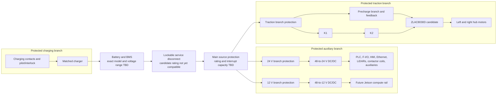

# Phase 2 Electrical and Power Architecture

## Purpose

This document defines the electrical and power architecture for the
simulation-only academic AMR. It freezes:

- the logical power domains and their isolation boundaries;
- the conceptual future physical power flow;
- the provisional auxiliary-load budget;
- energy and charging-state behavior to represent in simulation;
- logical electrical signals and ownership;
- fault responses and evidence requirements;
- the hardware-verification gates that prevent provisional BOM values from
  becoming physical design claims.

Phase 2 does not create a physical wiring design, select conductor or fuse
sizes, release a procurement BOM, implement PLC logic, define OPC UA or ROS
interfaces, or claim electrical or functional-safety compliance.

## Governing Scope

The current project uses two laptops and has no onboard physical electrical
system:

- Ubuntu laptop: ROS 2, Gazebo, RViz, navigation, control, and simulation;
- Windows laptop: TIA Portal V17, S7-1500F simulation, and HMI simulation;
- inter-laptop link: Ethernet with the detailed contract assigned to Phase 3.

Battery, BMS, charger, Jetson, PLC hardware, I/O, contactors, converters,
motor driver, motors, sensors, and field wiring remain conceptual candidates
for a possible future physical project. Their representation in this document
defines interfaces and simulated behavior only.

The architecture inherits the Phase 1 rule that the simulated PLC has final
drive-permission authority and that all nonzero motion passes through the
motion gate. Removing permission and representing traction-power isolation
are distinct actions, both of which shall be observable.

## Evidence Status

The following values are verified from official manufacturer sources:

| Item | Verified value used by Phase 2 | Evidence |
|---|---|---|
| User-supplied battery | 48 V nominal; 30 Ah nominal capacity; 1.44 kWh nominal stored energy | User confirmation on 2026-07-24; exact model and BMS evidence remain open |
| Each SICK MRS1104C-111011 / 1081208 | 10–30 VDC; 13 W typical; 37 W maximum; 30 W maximum during a one-second startup phase | [SICK exact datasheet](https://www.sick.com/media/pdf/4/44/044/dataSheet_MRS1104C-111011_1081208_en.pdf) |
| ZLAC8030D candidate | 24–48 VDC input; CANopen/RS-485; overvoltage and overcurrent protection are stated | [ZLTECH product page](https://www.zlingkj.com/en/robot-hub-servo-motor-series/550676) |
| DDR-240C-24 candidate | 33.6–67.2 VDC continuous input; 24 V, 10 A, 240 W output; 91% typical efficiency | [MEAN WELL DDR-240 specification](https://www.meanwell.com/Upload/PDF/DDR-240/DDR-240-SPEC.pdf) |
| DDR-60L-12 candidate | 18–75 VDC input; 12 V, 5 A, 60 W output; 91% typical efficiency | [MEAN WELL DDR-60 specification](https://www.meanwell.com/Upload/PDF/DDR-60/DDR-60-spec.pdf) |
| Blue Sea 6006 candidate | 48 VDC maximum; 300 A continuous rating under the manufacturer's stated conditions | [Blue Sea 6006 product page](https://www.bluesea.com/products/6006) |
| TE EV200AAANA candidate | 1 Form X SPST-NO main contact; 500 A contact rating; 9–36 VDC coil input | [TE EV200AAANA product page](https://www.te.com/en/product-1618002-7.html) |

The ZLLG10ASM800 V2.0 motor's 10-inch diameter is verified separately in
Phase 0. Its electrical, torque, current, encoder, and thermal values have not
passed the complete project hardware-evidence gate and are not used for cable,
battery, protection, or endurance sizing here.

## Architecture Principles

1. **Traction energy is separable from control energy.** An emergency stop or
   propulsion fault removes drive permission and represents isolation of the
   traction branch without immediately removing the power needed for PLC
   supervision, diagnostics, and orderly compute shutdown.
2. **De-energization is the default response.** Missing control power,
   contradictory feedback, incomplete precharge, charger connection, or a
   critical battery/BMS fault prevents traction-bus enable.
3. **Protection is layered and branch-specific.** The battery source, traction
   branch, converters, and downstream loads require protection appropriate to
   their conductors and fault levels. One main fuse is not treated as complete
   branch protection.
4. **Precharge is mandatory before traction contactor closure.** The detailed
   circuit cannot be sized until the driver's DC-link capacitance, allowed
   inrush, battery range, and switching sequence are verified.
5. **Regenerated energy requires an explicit destination.** Driver
   overvoltage protection is not evidence that the battery/BMS can accept all
   braking energy.
6. **Names are not ratings.** “48 V battery” does not prove compatibility with
   a device rated to 48 V maximum. Minimum, nominal, maximum charged, transient,
   and regenerative voltages must all be checked.
7. **Simulation preserves fault semantics, not physical equivalence.** A
   simulated contactor, fuse, BMS, or rail-valid signal demonstrates state and
   authority behavior only.
8. **No safety claim is inferred from redundancy.** Two conceptual contactors,
   two input channels, or an F-PLC model do not establish a Performance Level,
   Category, diagnostic coverage, or stopping distance.

## Conceptual Power Topology

This is a functional single-line architecture, not a construction drawing.
The exact order and topology of disconnects, fuses, contactors, precharge
elements, current sensing, charging contactors, and negative-return isolation
must be engineered against the selected battery, BMS, charger, driver, and
future risk assessment.

### Boundary invariants

- The service disconnect isolates the onboard source for maintenance; its
  exact pole count and lockout method remain future physical-design inputs.
- Source protection is located electrically close to the battery positive
  terminal in a future implementation.
- The 24 V control branch and 12 V compute branch originate upstream of the
  propulsion contactors so PLC state and diagnostics can persist after
  traction isolation.
- Each converter input and each downstream distribution branch requires
  coordinated protection. Ratings remain TBD.
- K1 and K2 are represented as series traction-isolation devices with
  independently commanded and monitored states.
- Driver enable is a secondary command boundary. The current ZLAC8030D
  evidence does not establish a certified safe-torque-off function.
- Charging status and connection inhibit motion. The charger and BMS retain
  responsibility for the electrochemical charging envelope.
- No conductor size, terminal, connector, enclosure, bonding point, or fuse
  value is authorized by this diagram.

## Power Domains

| Domain | Nominal concept | Loads or functions | Energized when traction is isolated? | Phase 2 status |
|---|---|---|---|---|
| Battery/source domain | 48 V, 30 Ah nominal LiFePO4 concept; exact operating range TBD | 1.44 kWh nominal stored energy, BMS, source protection | Source remains present until service isolation or BMS disconnect | Nominal rating confirmed; compatibility blocked |
| Traction domain | Battery-direct candidate | ZLAC8030D and two hub motors | No | Architecture defined; ratings blocked |
| 24 V control domain | Regulated 24 VDC | PLC/F-I/O candidate, Ethernet, HMI, LiDARs, contactor/precharge coils, warnings, fan, dock sensor | Yes, subject to battery/BMS and branch health | Provisional load budget |
| 12 V compute domain | Regulated 12 VDC | Future Jetson input and its downstream USB peripherals | Yes, subject to battery/BMS and branch health | Provisional load budget |
| Device-local low voltage | 5 V/USB and internal rails | IMU, CAN adapter, device electronics | Derived inside the compute/device boundary | Not a separately selected rail |
| Charging domain | Matched to battery/BMS | Charger, charging contacts, pilot/interlock | Motion prohibited | Exact design TBD |
| Laptop simulation domain | Laptop AC adapters/internal batteries | Current ROS/Gazebo and TIA/PLC/HMI execution | Independent of conceptual AMR rails | Current implemented reality |

## Provisional 24 V Load Budget

The workbook's 174 W total is arithmetically consistent with the listed
maximum/nameplate component loads. Only the two MRS1000 values have passed the
complete exact-variant electrical evidence gate. Every other line remains a
conceptual BOM input pending exact-model verification.

| Load group | Quantity × BOM load | Provisional total |
|---|---:|---:|
| Future S7-1200F CPU candidate | 1 × 12 W | 12 W |
| Future F-DI module candidate | 1 × 5 W | 5 W |
| Future F-DQ module candidate | 1 × 5 W | 5 W |
| SCALANCE XC216 candidate | 1 × 15 W | 15 W |
| KTP700 candidate | 1 × 8 W | 8 W |
| MRS1104C-111011 / 1081208 | 2 × 37 W maximum | 74 W |
| K1/K2 coil allowance | 2 × 8 W | 16 W |
| Precharge relay allowance | 1 × 2 W | 2 W |
| Signal tower | 1 × 5 W | 5 W |
| Sounder | 1 × 4 W | 4 W |
| Wi-Fi candidate | 1 × 12 W | 12 W |
| Dock sensor | 1 × 1 W | 1 W |
| Cabinet fan allowance | 1 × 15 W | 15 W |
| **Calculated output load** |  | **174 W** |

For the DDR-240C-24 candidate:

- calculated load current at 24 V: `174 W / 24 V = 7.25 A`;
- raw output headroom: `240 W - 174 W = 66 W`, or `2.75 A`;
- workbook design allowance: `174 W × 25% = 43.5 W`;
- required capacity with that allowance: `217.5 W`, or `9.0625 A`;
- residual headroom after that allowance: `22.5 W`, or `0.9375 A`;
- output utilization before allowance: 72.5%.

This is a provisional architecture check, not a final supply validation.
Temperature/altitude derating, input-voltage derating, wiring loss, simultaneous
states, converter mounting, fuse coordination, HMI/Wi-Fi/fan variants, coil
inrush, and future accessories remain unverified. The current simulated
S7-1500F consumes no physical 24 V power; the PLC figures above belong only to
the future S7-1200F conceptual BOM.

## Provisional 12 V Load Budget

| Load group | Provisional output load |
|---|---:|
| Future Jetson Orin Nano Developer Kit | 40 W |
| **Calculated output load** | **40 W** |

For the DDR-60L-12 candidate:

- calculated load current at 12 V: `40 W / 12 V = 3.333 A`;
- raw output headroom: `60 W - 40 W = 20 W`;
- required capacity with the workbook's 25% allowance: `50 W`, or `4.167 A`;
- residual headroom after that allowance: `10 W`, or `0.833 A`;
- output utilization before allowance: 66.7%.

The 40 W line does not yet prove that the Jetson operating mode, storage,
USB-powered IMU, USB-to-CAN adapter, and any future peripherals fit
simultaneously. Those loads must be measured or verified before this rail can
be closed.

At the manufacturers' 91% typical converter efficiencies, the two provisional
auxiliary output loads would draw approximately 235 W combined from the source
before distribution loss. This is an estimate for architecture comparison
only; minimum efficiency and worst-case thermal conditions shall govern a
future design.

## Traction and Energy Budget

The workbook's traction total is:

- two motors at a provisional 800 W nameplate each;
- one driver allowance of 25 W;
- total: 1,625 W.

This number shall not size the battery, BMS, fuse, conductors, disconnect,
contactors, precharge circuit, or runtime because it does not establish:

- continuous and peak DC-bus current under the approved duty cycle;
- simultaneous left/right motor demand;
- motor and driver efficiency maps;
- acceleration, slope, rolling-resistance, caster, and payload demand;
- driver current limits and thermal derating;
- regeneration magnitude and duration;
- BMS charge/discharge current and temperature limits;
- battery usable energy, reserve, aging, or voltage sag.

The 8-hour target shall be evaluated later using:

`required usable energy = mission duration × average source power`

where average source power includes traction duty, converter input power,
accessories, charging reserve, and distribution losses. Required battery
capacity shall be evaluated only after the exact pack voltage window and
usable-energy policy are known.

The user-confirmed 48 V, 30 Ah nominal rating gives:

- nominal stored energy: `48 V × 30 Ah = 1,440 Wh`;
- ideal average-power ceiling over eight hours with 100% usable energy:
  `1,440 Wh / 8 h = 180 W`;
- current provisional auxiliary output energy over eight hours:
  `(174 W + 40 W) × 8 h = 1,712 Wh`, equivalent to 35.7 Ah at 48 V before
  converter and distribution losses;
- approximate auxiliary source energy using both converters' 91% typical
  efficiency: `1,881 Wh`, equivalent to 39.2 Ah at 48 V before traction,
  reserve, aging, and distribution loss;
- idealized auxiliary-only duration for that all-listed load case:
  approximately 6.1 hours before reserve and traction demand.

The figures above are a sizing conflict, not a physical runtime prediction.
The auxiliary budget uses simultaneous maximum/nameplate allowances rather
than a measured duty cycle, and nominal battery energy is not fully usable.
The 30 Ah pack therefore does not close the 8-hour target. A measured mission
power profile, usable-energy window, reserve, and traction demand are required
before deciding whether the capacity, loads, or endurance target must change.

The user selected the 48 V, 30 Ah battery as the current planning baseline and
requested that runtime use 50% of the two motors' combined nameplate power:

- motor allowance: `2 × 800 W × 50% = 800 W`;
- driver allowance: `25 W`;
- provisional auxiliary source load: approximately `235 W`;
- total planning load: `800 W + 25 W + 235 W = 1,060 W`;
- ideal nominal runtime: `1,440 Wh / 1,060 W = 1.36 h`, approximately
  1 hour 22 minutes;
- equivalent nominal battery current: `1,060 W / 48 V = 22.1 A`.

The 1.36-hour value is the governing provisional runtime estimate until the
user changes the capacity or a measured duty cycle supersedes the 50% motor
assumption. It excludes usable-capacity limits, reserve, aging, voltage sag,
temperature, and unverified motor/driver efficiency, so it is not a guaranteed
physical runtime.

## Blocking Voltage-Compatibility Gate

The battery is now confirmed as 48 V nominal and 30 Ah, while its exact cell
count, minimum voltage, maximum charged voltage, transient behavior, BMS
limits, and model remain unknown.

This conflicts with two current candidates:

1. ZLTECH states a 24–48 VDC input range for the ZLAC8030D.
2. Blue Sea states 48 VDC maximum for the 6006 disconnect.

A nominal value alone is insufficient. Matching a 48 V nominal source to a
48 V maximum device rating does not prove that the fully charged or transient
pack voltage stays within the device rating. Therefore:

- the battery-to-driver connection is **not approved**;
- the 6006 disconnect is **not approved** for the unresolved pack;
- the BOM's provisional 80–100 A main-fuse range is **not approved**;
- the traction bus remains a functional simulation boundary only;
- no substitute battery, driver, disconnect, or protection device is selected
  without an explicit engineering change.

The gate can close only after an exact battery/BMS model establishes the full
operating and transient voltage window and every connected device is verified
above that window with suitable margin and environmental derating.

The DDR-240C-24 and DDR-60L-12 candidate input ranges cover the unresolved
nominal values, but they still require a maximum-pack-voltage, derating,
protection, and installation check before future use.

## Traction Isolation, Precharge, and Regeneration

### Contactors and feedback

K1 and K2 are conceptual series elements in the traction branch. The simulated
PLC shall command and observe them independently. Motion remains inhibited
when:

- command and feedback disagree;
- either contactor reports open when traction power is requested;
- either contactor reports closed when it was commanded open;
- feedback is absent, stale, or contradictory;
- a prior mismatch remains latched and reset conditions are unsatisfied.

The EV200AAANA source verifies a standard SPST-NO main contact and a 9–36 VDC
coil input. It does not close the project's requirement for independently
monitored auxiliary feedback, safety suitability, series coordination, coil
suppression, or achieved Performance Level. The exact contactor variant and
feedback architecture remain blocked.

### Precharge

Before the simulated traction bus can become ready:

1. traction isolation feedback must indicate the defined open state;
2. battery and control rails must be valid;
3. no charging, E-stop, bumper, BMS, or latched electrical fault may be active;
4. the precharge path is requested;
5. bus-voltage rise or an equivalent simulated completion condition is checked;
6. failure to complete within the future timeout produces a latched fault;
7. main-contactor closure and precharge bypass occur only after completion.

Exact resistor value, pulse energy, relay/contact rating, voltage threshold,
sequence, and timeout depend on driver capacitance and battery data and remain
TBD. The BOM's 100 ohm/100 W entry is not authorized.

### Regeneration

Negative motor power may raise the DC-bus voltage. Phase 2 requires an explicit
future answer to all of the following:

- whether ZLAC8030D returns energy to the DC bus in the selected speed mode;
- whether the battery/BMS accepts the peak regenerative current at every SOC
  and temperature;
- whether a braking resistor, clamp, dump load, or different driver is needed;
- how an overvoltage or BMS charge-rejection event changes the stop response;
- how the behavior is represented and fault-injected in simulation.

Until verified, commanded deceleration and emergency-stop behavior cannot be
translated into physical stopping performance.

## Charging Architecture

Charging is a mutually exclusive operating condition with motion permission.
The architecture requires:

- charger output and charge profile matched to the exact battery/BMS;
- separately protected charging conductors and contacts;
- a pilot, dock-present, charger-present, or equivalent positive indication;
- PLC-visible charger-ready, charging, complete, and fault states where the
  selected equipment supports them;
- motion inhibition whenever the charging connection or charge state is
  active or contradictory;
- prevention of automatic motion immediately after charger removal;
- an operator/system reset and readiness evaluation before drive permission;
- a defined response to charger communication loss, welded contacts, pack
  overtemperature, and BMS charge rejection.

Exact contact current class, touch protection, polarity/keying, contactor
arrangement, charger protocol, isolation, and docking sequence remain TBD.
The ROBOFIX and charger BOM lines are conceptual placeholders only.

## Energy and Power States

These states define electrical meaning, not the detailed PLC state machine
assigned to Phase 12.

| State | Electrical meaning | Motion condition |
|---|---|---|
| `ENERGY_ISOLATED` | Source absent, service-isolated, or all simulated rails invalid | Inhibited |
| `CONTROL_POWERED` | Required control rail valid; traction path open; supervision available | Inhibited |
| `PRECHARGE_ACTIVE` | Precharge requested and completion not yet accepted | Inhibited |
| `TRACTION_READY` | Precharge complete; K1/K2 feedback valid; drive bus valid; driver not yet permitted to move | Inhibited until all motion conditions pass |
| `DRIVE_ENABLED` | Electrical prerequisites and PLC drive permission valid | Motion may be requested through the Phase 1 gate |
| `CHARGING` | Charger connection or active charge state accepted | Inhibited |
| `LOW_ENERGY` | Warning threshold crossed; control and traction may remain available according to later policy | No new mission by default; return/stop policy TBD |
| `CRITICAL_ENERGY` | Shutdown reserve or BMS critical condition reached | Controlled stop only while valid state and energy remain; otherwise inhibit |
| `ELECTRICAL_FAULT` | Contradictory feedback, rail failure, precharge failure, BMS fault, over/undervoltage, or equivalent critical fault | Inhibited; reset policy deferred |

Required invariants:

- `CHARGING`, `PRECHARGE_ACTIVE`, `ENERGY_ISOLATED`, and `ELECTRICAL_FAULT`
  cannot coexist with nonzero gated motion.
- `DRIVE_ENABLED` requires valid control power, completed precharge, consistent
  contactor feedback, a valid traction bus, no critical energy condition, and
  explicit PLC permission.
- State restoration after a fault or restart does not automatically restore
  drive permission.
- Thresholds, debounce, timers, latching, acknowledgement, and transition
  implementation are Phase 12 decisions.

## Logical Simulated Electrical Signals

The identifiers below freeze meaning and ownership only. Phase 3 will assign
OPC UA nodes, ROS interfaces, data types, timing, freshness, quality, and
acknowledgement.

| ID | Logical signal | Source/authority | Meaning and required fail behavior |
|---|---|---|---|
| P2-SIG-001 | Battery present | Energy model | False inhibits precharge and traction |
| P2-SIG-002 | Pack voltage | Energy model | Used only with approved valid range; invalid/non-finite inhibits |
| P2-SIG-003 | State of charge | Energy model | Drives warning/critical policy after thresholds are approved |
| P2-SIG-004 | BMS ready | Energy model/BMS boundary | False inhibits traction |
| P2-SIG-005 | BMS warning | Energy model/BMS boundary | Diagnostic; later policy determines mission action |
| P2-SIG-006 | BMS critical fault | Energy model/BMS boundary | Causes the PLC to inhibit traction and command isolation |
| P2-SIG-007 | 24 V control rail valid | Electrical plant model | False makes drive permission fail inactive |
| P2-SIG-008 | 12 V compute rail valid | Electrical plant model | False removes ROS heartbeat/readiness |
| P2-SIG-009 | E-stop channel A/B state | Safety-input model | Any unsafe, inconsistent, or invalid state inhibits |
| P2-SIG-010 | Bumper channel A/B state | Safety-input model | Any unsafe, inconsistent, or invalid state inhibits |
| P2-SIG-011 | Precharge command | Simulated PLC | Request only; cannot assert completion |
| P2-SIG-012 | Precharge complete | Electrical plant model | Requires the future validated voltage criterion |
| P2-SIG-013 | K1 command | Simulated PLC | Independent request to K1 model |
| P2-SIG-014 | K1 feedback | Electrical plant model | Must agree with commanded and expected state |
| P2-SIG-015 | K2 command | Simulated PLC | Independent request to K2 model |
| P2-SIG-016 | K2 feedback | Electrical plant model | Must agree with commanded and expected state |
| P2-SIG-017 | Traction bus valid | Electrical plant model | False inhibits drive enable and motion |
| P2-SIG-018 | Driver electrical fault | Driver/plant model | Critical fault inhibits motion; isolation policy is Phase 12 |
| P2-SIG-019 | Charger connected | Charging model | True inhibits motion |
| P2-SIG-020 | Charger active/complete/fault | Charging model | Drives charging state and diagnostics |
| P2-SIG-021 | Electrical state | Simulated PLC authority | Authoritative state derived from validated inputs |
| P2-SIG-022 | Electrical inhibition reason | Simulated PLC/health boundary | Records the dominant reason; enumeration is Phase 3/12 |

No signal above is a ROS topic name, OPC UA node name, PLC tag, or safety-rated
I/O definition.

## Fault Response Architecture

| Condition | Required Phase 2 response |
|---|---|
| Battery/BMS unavailable or critical | Prevent precharge, remove drive permission, command traction isolation |
| 24 V control rail invalid | Permission fails inactive; traction contactors are represented de-energized |
| 12 V compute rail invalid | ROS readiness and heartbeat fail; PLC removes permission according to Phase 12 timing |
| E-stop or bumper unsafe/inconsistent | Remove drive permission and command traction isolation; no stopping-distance claim |
| Precharge timeout or invalid bus rise | Keep K1/K2 from accepted ready state; latch diagnosable fault |
| K1/K2 command-feedback mismatch | Inhibit motion, request open state, latch fault, block automatic restart |
| Traction undervoltage | Inhibit or controlled stop according to available valid state; record fault |
| Traction overvoltage/regeneration rejection | Inhibit drive and record the fault; physical response remains blocked pending a verified energy-disposal policy |
| Branch protection trip | Mark affected rail/load invalid and preserve diagnostic reason where control power remains |
| LiDAR power loss | Perception health path inhibits motion under the Phase 1 default policy |
| Charger connection/charging | Inhibit motion and block drive-enable transition |
| Contradictory or stale electrical signals | Fail inhibited and record the contradiction |
| Simulation restart or signal reset | Return to a non-permissive state; no automatic contactor closure or motion |

## Grounding, Bonding, EMC, and Segregation Boundary

A future physical design shall define:

- chassis protective bonding and the DC return-to-chassis policy;
- isolated/non-isolated converter and communication boundaries;
- motor phase, encoder, Ethernet, USB, CAN, safety-I/O, and power routing;
- shield termination and connector bonding;
- surge, transient, reverse-polarity, and electrostatic-discharge protection;
- separation of noisy traction conductors from sensor and encoder wiring;
- enclosure ingress, thermal, creepage, clearance, and service-access needs;
- conductor ampacity, temperature rating, voltage drop, flexing, bend radius,
  and termination;
- electromagnetic compatibility test criteria.

Phase 2 deliberately does not select these values because the battery, current
profiles, enclosure, cable lengths, connector set, environment, and mechanical
layout are unknown. IEC 60204-1 remains a conceptual reference only; the
current simulation is not assessed for compliance.

## Simulation Implementation Contract

Later implementation shall provide a deterministic, fault-injectable
electrical plant model with:

- the energy states and invariants in this document;
- independently injectable battery, BMS, rail, precharge, K1, K2, driver, and
  charger conditions;
- explicit command versus feedback separation;
- configurable but non-permissive defaults for unresolved voltage, SOC, and
  timing thresholds;
- a default startup state with traction inhibited;
- no automatic reset or permission restoration after process restart;
- simulation-time timestamps and reproducible transition logs;
- evidence sufficient to reconstruct why motion was permitted or inhibited.

An SOC/energy-consumption model is optional until a later phase defines the
required fidelity. If implemented, it must identify its assumptions and shall
not claim battery-runtime validation.

Implementation ownership:

| Later phase | Owned detail |
|---|---|
| Phase 3 | Transport, data types, quality, freshness, acknowledgement, namespaces, OPC UA nodes, and ROS contracts |
| Phase 4 | Package, executable, configuration, lifecycle, and test ownership |
| Phase 5 | Simulation-facing electrical/PLC/driver adapter boundaries |
| Phase 6 | Any Gazebo-side power/energy plant representation required by the robot simulation |
| Phase 12 | PLC program, detailed state machine, timers, latches, reset, cause/effect, HMI, and shutdown sequence |
| Phase 13 | End-to-end fault injection and cross-host integration |
| Phase 14 | Traceability, scenario count, pass/fail criteria, and evidence |

## Verification Plan

Phase 2 calculations are accepted only as architecture arithmetic. Later tests
shall verify:

1. every physical rating against an exact model, revision, and official
   document;
2. full battery voltage compatibility across charge, discharge, transient, and
   regenerative conditions;
3. load budget across declared simultaneous modes and environmental derating;
4. branch and source protection coordination using available fault current;
5. precharge timing, voltage threshold, resistor pulse energy, and failure
   response;
6. K1/K2 independent command/feedback mismatch detection;
7. continued supervision when traction is isolated;
8. charging interlock and restart behavior;
9. low-energy controlled-stop and shutdown-reserve behavior;
10. regeneration and overvoltage response;
11. default inhibited startup and restart;
12. deterministic fault records for every inhibition.

Physical conductor, temperature-rise, insulation, EMC, shock, arc, short
circuit, stopping, and functional-safety tests remain outside the current
simulation project.

## Architecture Decisions

| ID | Decision | Status |
|---|---|---|
| P2-ADR-001 | Separate traction, 24 V control, 12 V compute, device-local, and charging domains. | Phase 2 decision |
| P2-ADR-002 | Keep control and compute power conceptually upstream of propulsion contactors so supervision can survive traction isolation. | Phase 2 decision |
| P2-ADR-003 | Use branch-specific protection in addition to source protection; exact values remain gated. | Phase 2 decision |
| P2-ADR-004 | Require precharge and independent completion feedback before traction readiness. | Phase 2 decision |
| P2-ADR-005 | Represent K1 and K2 as independently commanded and monitored series traction-isolation elements. | Conceptual only; physical safety suitability unverified |
| P2-ADR-006 | Treat driver enable as a secondary non-safety boundary and PLC permission as final authority. | Phase 2 decision |
| P2-ADR-007 | Keep the 174 W/217.5 W/240 W 24 V budget as provisional architecture evidence, not final sizing. | Phase 2 decision |
| P2-ADR-008 | Keep the 40 W/50 W/60 W 12 V budget as provisional until compute peripherals and operating mode are verified. | Phase 2 decision |
| P2-ADR-009 | Reject the 1,625 W nameplate sum as a battery, protection, conductor, or endurance sizing basis. | Phase 2 decision |
| P2-ADR-010 | Block battery-to-driver and battery-to-6006 compatibility until the exact pack voltage window is known. | Phase 2 blocking gate |
| P2-ADR-011 | Require an explicit regenerative-energy path and fault response before physical motion validation. | Phase 2 decision |
| P2-ADR-012 | Make charging and motion permission mutually exclusive. | Phase 2 decision |
| P2-ADR-013 | Freeze logical electrical states and signal meanings while deferring transport and PLC implementation. | Phase 2 decision |
| P2-ADR-014 | Fail inhibited on missing, stale, contradictory, or invalid critical electrical state. | Phase 2 decision |
| P2-ADR-015 | Make no PL, SIL, Category, electrical-compliance, runtime, or physical stopping claim from this architecture. | Governing scope |
| P2-ADR-016 | Record the 48 V, 30 Ah battery as 1.44 kWh nominal and keep the 8-hour endurance target open because the provisional auxiliary load case already exceeds that energy before traction and reserve. | User input and Phase 2 sizing decision |
| P2-ADR-017 | Retain the 48 V, 30 Ah battery as the current capacity baseline and use 50% of combined motor nameplate power for a provisional 1.36-hour runtime estimate until the user changes capacity or measured duty-cycle evidence is available. | User-confirmed Phase 2 planning baseline |

## Deferred Inputs and Blocking Evidence

- exact battery and BMS manufacturer, model, cell configuration, chemistry
  details, minimum/maximum voltage, usable capacity, continuous/peak discharge
  current, charge-acceptance current, available fault current, temperatures,
  SOC limits, contactor behavior, and communication interface;
- ZLAC8030D revision/manual, full input/transient range, DC-link capacitance,
  current limits, regeneration/braking behavior, enable behavior, protection,
  and fault outputs;
- motor exact electrical, torque, speed, encoder, efficiency, thermal, and
  current data;
- mission power profile and measured average/peak loads;
- acceptance of the confirmed 30 Ah capacity against the usable-energy window,
  reserve, aging allowance, and 8-hour endurance evidence;
- exact source/branch fuse families, DC voltage ratings, interrupt capacities,
  time-current coordination, and values;
- disconnect model rated above the full pack and transient voltage range;
- exact contactor variants, auxiliary/diagnostic feedback, DC breaking duty,
  coil suppression, series coordination, failure data, and safety suitability;
- precharge topology, capacitance, resistance, pulse energy, relay, thresholds,
  and timing;
- conductor lengths, ampacity, voltage drop, insulation, temperature, routing,
  connectors, and terminals;
- charger, charging contacts, charging current, pilot/interlock, protocol, and
  dock sequence;
- low-SOC warning, mission-inhibit, critical-stop, and shutdown-reserve
  thresholds;
- grounding, bonding, shielding, isolation, surge/transient, EMC, ingress, and
  thermal design;
- future risk assessment, safety-function specification, PLr, stop category,
  validation plan, and competent review.

## Phase 2 Acceptance Criteria

Phase 2 is ready for user approval when:

- logical power domains, sources, loads, isolation, and charging boundaries are
  unambiguous;
- control-power persistence and traction-isolation behavior agree with Phase 1;
- provisional 24 V and 12 V arithmetic is reproducible and caveated;
- the 48 V, 30 Ah nominal battery rating and unresolved 8-hour energy conflict
  are recorded without treating nominal energy as usable energy;
- the traction nameplate sum is not misused as a sizing result;
- battery/driver/disconnect voltage incompatibility is explicitly blocked;
- precharge, contactor feedback, regeneration, and protection gates are
  recorded without guessed values;
- energy states and logical simulated electrical signals are defined;
- detailed communication and PLC logic remain in Phases 3 and 12;
- simulation evidence is clearly separated from physical electrical and safety
  validation;
- project status, TODO, changelog, parameter register, and session handoff
  agree;
- documentation consistency checks pass;
- the user approves Phase 2 before a local commit or any Phase 3 work.

## Skills Used

- `karpathy-guidelines`: constrained Phase 2 to the smallest architecture
  deliverable, surfaced assumptions, and defined verifiable exit criteria.
- `debug-mantra`: isolated the missing optional XLSX Python library from the
  workbook itself and led to a no-install, read-only extraction path.
