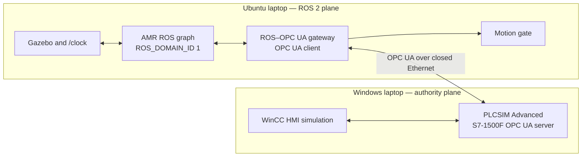

# Phase 3 Communication Architecture

## Purpose

This document defines the communication architecture for the simulation-only
academic AMR. It freezes:

- the separation between the Ubuntu ROS 2 data plane and the Windows OPC UA
  authority plane;
- the two-laptop Ethernet topology and non-applied addressing plan;
- ROS namespaces, interface classes, and QoS profiles;
- the OPC UA endpoint role, namespace-resolution rule, data ownership, data
  types, coherent-snapshot method, command acknowledgement, and reconnect
  behavior;
- heartbeat, freshness, and timeout values used at the communication boundary;
- simulation-time, steady-time, and wall-clock responsibilities;
- communication fault behavior, observability, and later implementation
  ownership.

Phase 3 does not configure either laptop, create ROS packages or custom
messages, implement a ROS OPC UA client, create TIA Portal data blocks or PLC
logic, define the detailed PLC state machine, configure physical sensors, or
claim deterministic or safety-rated communication.

## Governing Scope

The current runtime uses:

- Ubuntu laptop: ROS 2 Humble, Gazebo Harmonic, RViz, estimation, perception,
  navigation, MPC, mission supervision, motion gating, and the future OPC UA
  gateway;
- Windows laptop: TIA Portal V17, S7-1500F simulation through PLCSIM Advanced
  V4.0 provisionally, and WinCC HMI simulation;
- one closed Ethernet simulation link between the two laptops;
- OPC UA client/server communication across that link;
- Fast DDS within the Ubuntu ROS 2 graph.

S7-1200F, SCALANCE, Jetson, physical LiDARs, IMU, motor driver, motors, and
field wiring remain conceptual future hardware. Phase 3 defines no physical
fieldbus, safety protocol, or production-network deployment.

## Communication Principles

1. **Separate communication planes.** ROS 2/DDS stays on the Ubuntu host.
   Windows receives no ROS discovery or DDS traffic. OPC UA is the only
   inter-laptop application protocol.
2. **One writer per field.** Every OPC UA variable and authoritative ROS topic
   has one declared owner. Consumers never write a value they merely observe.
3. **Permission fails inactive.** Missing, stale, malformed, contradictory, or
   unacknowledged critical communication state is interpreted as no drive
   permission.
4. **Transport health is not machine permission.** A connected OPC UA session
   is necessary but never sufficient for motion.
5. **Application watchdogs are explicit.** OPC UA session timeout, DDS
   discovery, TCP keepalive, and certificate validity are not substitutes for
   the ROS/PLC heartbeat and freshness rules.
6. **No pulse-only commands.** Requests use a level plus a sequence/commit
   number and receive an explicit acknowledgement. A short pulse may not be
   the sole representation of reset, stop, or enable intent.
7. **No hardcoded namespace index.** The OPC UA client resolves Siemens'
   namespace URI at every session and verifies the expected browse paths,
   types, and access rights.
8. **No timestamp authority crossing.** PLC watchdogs use PLC elapsed time;
   ROS transport watchdogs use a steady clock; robot data uses Gazebo
   simulation time. Cross-host wall time is for evidence correlation only.
9. **Reconnect is non-permissive.** Reconnection restores observation and
   request transport, not prior permission, command, goal, or reset state.
10. **Simulation evidence remains bounded.** The architecture demonstrates
    communication and state behavior, not functional safety, deterministic
    control, or physical stopping performance.

## Plane and Authority Topology



The motion gate consumes a coherent PLC-state snapshot published by the
gateway. It does not consume individual OPC UA values directly. OPC UA
disconnect, schema failure, stale state, or bad quality makes that snapshot
non-permissive.

## Ethernet Architecture

### Non-applied addressing plan

| Item | Planned value | Rule |
|---|---|---|
| Simulation subnet | `192.168.50.0/24` | Dedicated point-to-point or isolated simulation switch only |
| Ubuntu ROS laptop | `192.168.50.10/24` | Static address on the selected simulation interface |
| Windows PLC laptop | `192.168.50.20/24` | Static address on the PLCSIM virtual-Ethernet path |
| Default gateway | None on this interface | The simulation link must not become an Internet route |
| DNS | None required | OPC UA uses the approved address/endpoint configuration |
| DHCP | Disabled | Address changes may not silently move the authority endpoint |
| OPC UA server port | TCP `4840` | Windows inbound only from `192.168.50.10` |
| ROS domain | `ROS_DOMAIN_ID=1` | Ubuntu graph only; observed local baseline |
| ROS transport scope | `ROS_LOCALHOST_ONLY=1` | Phase 4 deployment setting; current shell was observed as `0` |

These values are configuration inputs, not changes already applied. Before
Phase 12/13 configuration, both laptops shall be checked for subnet collision,
interface identity, firewall ownership, and PLCSIM Advanced adapter support. A
collision requires an approved replacement subnet and synchronized update of
all records; it does not justify adding a gateway or using DHCP.

### Network isolation

- Prefer a direct cable or an isolated unmanaged simulation switch.
- Do not connect this subnet to a campus, office, production, or public
  network.
- If either laptop also uses Wi-Fi or another Ethernet interface for Internet
  access, IP forwarding and connection sharing shall be disabled.
- Windows Firewall shall allow inbound TCP 4840 only from the Ubuntu simulation
  address and block other inbound traffic on the simulation interface.
- Ubuntu shall initiate the OPC UA connection. No inbound Windows-initiated
  application connection is required.
- Phase 4 shall set `ROS_LOCALHOST_ONLY=1`; all required ROS processes are on
  Ubuntu, so no DDS discovery or user traffic needs the Windows simulation
  interface.
- Packet capture is permitted for academic diagnosis only and must not contain
  credentials or private keys in project artifacts.

OPC UA is not credited as a safety protocol or deterministic fieldbus.
Network isolation is defense in depth, not a safety function.

## OPC UA Endpoint and Security Contract

| Property | Phase 3 contract |
|---|---|
| Server | PLCSIM Advanced virtual S7-1500F on Windows |
| Client | One ROS 2 OPC UA gateway instance on Ubuntu |
| Endpoint | `opc.tcp://192.168.50.20:4840` unless the verified server exposes a required path |
| Client application URI | `urn:amr:ros2:opcua-gateway` |
| Siemens namespace URI | `http://www.siemens.com/simatic-s7-opcua` |
| Namespace index | Resolved from the namespace URI on every session; never stored as a fixed number |
| Preferred message mode | `SignAndEncrypt` |
| Preferred policy | `Basic256Sha256`, subject to exact V17/PLCSIM/CPU capability verification |
| Application trust | Mutual application-certificate trust with an explicit allowlist |
| User identity | Dedicated least-privilege identity if the verified server supports it |
| Unsecured endpoint | Prohibited for drive-enabled tests |

The exact TIA Portal V17 update, PLCSIM Advanced V4.0 update, simulated CPU
model/firmware, supported endpoint policies, and user-token support remain
installation evidence gates. If the provisional toolchain cannot provide the
preferred secure endpoint, `SecurityPolicy None` may be used only for a
documented commissioning diagnostic on the closed network while the motion
gate is forced inhibited. It may not be silently accepted as the final
drive-enabled integration configuration.

Certificate rules:

- private keys remain outside the Git repository;
- certificate files contain no shared private key between applications;
- trust is by approved application certificate, not “accept all”;
- expired, not-yet-valid, untrusted, hostname/address-mismatched, or
  policy-downgraded sessions fail closed;
- certificate rotation is an explicit maintenance action and does not restore
  permission automatically;
- endpoint discovery is validated against the configured server application
  identity before a session is accepted.

## OPC UA Address-Space Contract

The TIA project shall expose one symbolic interface root named
`DB_AMR_OPCUA`. The names below are browse-path requirements, not generated
PLC code:

```text
DB_AMR_OPCUA
├── Interface
├── RosToPlc
├── PlcToRos
└── Diagnostics
```

The client shall:

1. resolve the Siemens namespace URI;
2. browse from the configured symbolic root;
3. verify every required node exists;
4. verify built-in type, scalar/array rank, read/write access, and expected
   owner;
5. reject duplicate, missing, writable-authority, or incompatible nodes;
6. verify `InterfaceVersion` before creating a ready snapshot;
7. create subscriptions only after schema validation passes.

Numeric namespace indexes and server-generated NodeIds may change when the
server address space changes. The gateway configuration therefore stores the
namespace URI and symbolic browse paths, not strings such as `ns=3`.

### Interface header

| Browse path under `Interface` | OPC UA built-in type | Owner | Meaning |
|---|---|---|---|
| `InterfaceVersion` | `UInt32` | PLC project | `0x00010000` for Phase 3 major 1, minor 0 |
| `RequiredClientMajor` | `UInt16` | PLC project | Required gateway major version, initially `1` |

A major-version mismatch is blocking. A later minor-version change is allowed
only when all required Phase 3 nodes retain compatible types and semantics.
The client records but never guesses around a mismatch.

## ROS-to-PLC Data Contract

The ROS gateway is the sole OPC UA writer for `RosToPlc`. The PLC and HMI may
read these fields but may not write them.

### Gateway, health, and request fields

| Browse path under `RosToPlc` | Type | Update/commit rule | Meaning |
|---|---|---|---|
| `ClientBootId` | `UInt32` | At connection and every bundle | Current gateway boot identity |
| `HeartbeatSeq` | `UInt32` | Increment every 100 ms | Liveness counter; wrap is valid |
| `RosReady` | `Boolean` | Every bundle | Required ROS lifecycle and health policy currently passes |
| `SimClockRunning` | `Boolean` | Every bundle | Gazebo time is present and progressing |
| `MotionEnableRequest` | `Boolean` | Level, default false | Request only; cannot grant permission |
| `ControlledStopRequest` | `Boolean` | Level held until acknowledged | Requests a controlled stop while valid state remains |
| `ResetRequest` | `Boolean` | True in a new command bundle | Request only; PLC evaluates eligibility |
| `RequestSeq` | `UInt32` | Increment for a new request bundle | Identifies request bundle and replay |
| `InputValidMaskLow` | `UInt32` | Before commit | Validity bits for critical ROS/plant inputs |
| `InputValidMaskHigh` | `UInt32` | Before commit | Reserved continuation |
| `CommitSeq` | `UInt32` | Incremented and written last | Makes the preceding bundle eligible for PLC acceptance |

`CommitSeq` is the final write in a bundle. The PLC accepts new values only
when the commit changes, required fields are valid, `ClientBootId` matches the
current handshake, and the complete bundle passes Phase 12 validation. OPC UA
multi-node writes are not assumed atomic.

`HeartbeatSeq` changing proves only that the gateway update loop is running.
`RosReady`, `SimClockRunning`, request state, and the input-valid mask remain
independent conditions.

### Electrical-plant and safety-input fields

| Logical ID | Browse path under `RosToPlc` | Type | Invalid behavior |
|---|---|---|---|
| P2-SIG-001 | `BatteryPresent` | `Boolean` | Inhibit |
| P2-SIG-002 | `PackVoltageV` | `Double` | Non-finite/out-of-policy inhibits |
| P2-SIG-003 | `StateOfChargePct` | `Double` | Invalid disables SOC policy; critical ambiguity inhibits |
| P2-SIG-004 | `BmsReady` | `Boolean` | Inhibit |
| P2-SIG-005 | `BmsWarning` | `Boolean` | Diagnose; Phase 12 policy |
| P2-SIG-006 | `BmsCriticalFault` | `Boolean` | Inhibit and isolate request |
| P2-SIG-007 | `Control24VValid` | `Boolean` | Inhibit |
| P2-SIG-008 | `Compute12VValid` | `Boolean` | ROS ready false and inhibit |
| P2-SIG-009 | `EstopChannelA`, `EstopChannelB` | `Boolean` each | Unsafe/inconsistent/invalid inhibits |
| P2-SIG-010 | `BumperChannelA`, `BumperChannelB` | `Boolean` each | Unsafe/inconsistent/invalid inhibits |
| P2-SIG-012 | `PrechargeComplete` | `Boolean` | Inhibit readiness |
| P2-SIG-014 | `K1Feedback` | `Boolean` | Mismatch/invalid inhibits |
| P2-SIG-016 | `K2Feedback` | `Boolean` | Mismatch/invalid inhibits |
| P2-SIG-017 | `TractionBusValid` | `Boolean` | Inhibit |
| P2-SIG-018 | `DriverElectricalFault` | `Boolean` | Inhibit |
| P2-SIG-019 | `ChargerConnected` | `Boolean` | Inhibit |
| P2-SIG-020 | `ChargerActive`, `ChargerComplete`, `ChargerFault` | `Boolean` each | Contradiction/invalid inhibits |

The two-channel fields model logical architecture only. Transporting two
booleans through standard OPC UA creates no fail-safe channel, diagnostic
coverage, PL, SIL, or Category claim.

`InputValidMaskLow` uses these fixed bit positions:

| Bit | Field | Bit | Field |
|---:|---|---:|---|
| 0 | `BatteryPresent` | 12 | `PrechargeComplete` |
| 1 | `PackVoltageV` | 13 | `K1Feedback` |
| 2 | `StateOfChargePct` | 14 | `K2Feedback` |
| 3 | `BmsReady` | 15 | `TractionBusValid` |
| 4 | `BmsWarning` | 16 | `DriverElectricalFault` |
| 5 | `BmsCriticalFault` | 17 | `ChargerConnected` |
| 6 | `Control24VValid` | 18 | `ChargerActive` |
| 7 | `Compute12VValid` | 19 | `ChargerComplete` |
| 8 | `EstopChannelA` | 20 | `ChargerFault` |
| 9 | `EstopChannelB` | 21 | `RosReady` |
| 10 | `BumperChannelA` | 22 | `SimClockRunning` |
| 11 | `BumperChannelB` |  |  |

Bits 23–31 and all high-mask bits are reserved and written zero in interface
version 1.0. A set bit means the source has produced a semantically valid
value; it does not mean a boolean value is true.

## PLC-to-ROS Data Contract

The PLC is the sole writer for `PlcToRos`. The ROS gateway and HMI may read
these fields. The ROS client shall not write them even if server access rights
are accidentally permissive.

| Browse path under `PlcToRos` | Type | Meaning |
|---|---|---|
| `ServerBootId` | `UInt32` | Authoritative runtime boot identity |
| `StateSeq` | `UInt32` | Changes after a coherent PLC output update |
| `HeartbeatAcceptedSeq` | `UInt32` | Last ROS heartbeat observed by PLC logic |
| `RequestAckSeq` | `UInt32` | Last fully evaluated `RequestSeq` |
| `RequestResult` | `UInt16` | Result enumeration below |
| `CommunicationReady` | `Boolean` | Protocol/schema/heartbeat accepted by PLC logic |
| `DrivePermission` | `Boolean` | Final PLC permission; false is the safe default |
| `MachineStopped` | `Boolean` | Authoritative stopped-state indication |
| `ResetEligible` | `Boolean` | Reset prerequisites currently pass |
| `EstopActive` | `Boolean` | Authoritative PLC state |
| `ProtectiveStopActive` | `Boolean` | Authoritative PLC state |
| `LatchedFault` | `Boolean` | PLC fault latch is active |
| `PlcWatchdogHealthy` | `Boolean` | Application heartbeat watchdog is healthy |
| `MachineState` | `UInt16` | Transport state enumeration |
| `ElectricalState` | `UInt16` | P2-SIG-021 enumeration |
| `InhibitionReason` | `UInt16` | P2-SIG-022 dominant reason |
| `InhibitionMaskLow` | `UInt32` | Concurrent inhibition reason bits |
| `InhibitionMaskHigh` | `UInt32` | Reserved continuation |
| `PrechargeCommand` | `Boolean` | P2-SIG-011 |
| `K1Command` | `Boolean` | P2-SIG-013 |
| `K2Command` | `Boolean` | P2-SIG-015 |
| `OutputValidMaskLow` | `UInt32` | Validity of published fields |
| `OutputValidMaskHigh` | `UInt32` | Reserved continuation |

`OutputValidMaskLow` uses these fixed bit positions:

| Bit | Field or coherent group | Bit | Field or coherent group |
|---:|---|---:|---|
| 0 | `HeartbeatAcceptedSeq` | 8 | `LatchedFault` |
| 1 | `RequestAckSeq`, `RequestResult` | 9 | `PlcWatchdogHealthy` |
| 2 | `CommunicationReady` | 10 | `MachineState` |
| 3 | `DrivePermission` | 11 | `ElectricalState` |
| 4 | `MachineStopped` | 12 | `InhibitionReason`, masks |
| 5 | `ResetEligible` | 13 | `PrechargeCommand` |
| 6 | `EstopActive` | 14 | `K1Command` |
| 7 | `ProtectiveStopActive` | 15 | `K2Command` |

Bits 16–31 and all high-mask bits are reserved and zero in interface version
1.0.

### Request result enumeration

| Value | Name | Meaning |
|---:|---|---|
| 0 | `NONE` | No request has been evaluated for the current boot |
| 1 | `ACCEPTED` | Request accepted; resulting state is still authoritative separately |
| 2 | `REJECTED_NOT_READY` | Readiness prerequisite missing |
| 3 | `REJECTED_NOT_ELIGIBLE` | Reset or mode prerequisite missing |
| 4 | `REJECTED_STALE` | Request or client boot identity is stale |
| 5 | `REJECTED_INVALID` | Values, validity, or combination invalid |
| 6 | `REJECTED_FAULT` | Active fault blocks the request |
| 7 | `REJECTED_PROTOCOL` | Version/schema/communication condition blocks evaluation |

An `ACCEPTED` motion-enable request is not drive permission. Only the current,
fresh `DrivePermission` field can authorize the downstream motion gate.

### State enumerations

Transport enumerations define stable wire values; Phase 12 owns transition
logic, timers, latches, and cause/effect.

| `MachineState` value | Name |
|---:|---|
| 0 | `UNKNOWN` |
| 1 | `INHIBITED` |
| 2 | `READY` |
| 3 | `DRIVE_ENABLED` |
| 4 | `STOPPING` |
| 5 | `FAULTED` |
| 6 | `CHARGING` |

| `ElectricalState` value | Phase 2 state |
|---:|---|
| 0 | `UNKNOWN` |
| 1 | `ENERGY_ISOLATED` |
| 2 | `CONTROL_POWERED` |
| 3 | `PRECHARGE_ACTIVE` |
| 4 | `TRACTION_READY` |
| 5 | `DRIVE_ENABLED` |
| 6 | `CHARGING` |
| 7 | `LOW_ENERGY` |
| 8 | `CRITICAL_ENERGY` |
| 9 | `ELECTRICAL_FAULT` |

| `InhibitionReason` value | Name |
|---:|---|
| 0 | `NONE` |
| 1 | `COMMUNICATION_NOT_READY` |
| 2 | `ROS_HEARTBEAT_STALE` |
| 3 | `ROS_NOT_READY` |
| 4 | `SIM_CLOCK_INVALID` |
| 5 | `CONTROL_RAIL_INVALID` |
| 6 | `COMPUTE_RAIL_INVALID` |
| 7 | `ESTOP_ACTIVE` |
| 8 | `BUMPER_ACTIVE` |
| 9 | `BMS_NOT_READY` |
| 10 | `BMS_CRITICAL` |
| 11 | `PRECHARGE_INCOMPLETE` |
| 12 | `CONTACTOR_MISMATCH` |
| 13 | `TRACTION_BUS_INVALID` |
| 14 | `DRIVER_FAULT` |
| 15 | `CHARGER_CONNECTED` |
| 16 | `CHARGING_ACTIVE` |
| 17 | `CRITICAL_ENERGY` |
| 18 | `PLC_LATCHED_FAULT` |
| 19 | `RESET_REQUIRED` |
| 20 | `PROTOCOL_FAULT` |
| 21 | `INPUT_INVALID` |
| 255 | `OTHER` |

The dominant reason is for operator comprehension. The mask and detailed
diagnostics preserve concurrent causes; the dominant reason may not hide
another active inhibition.

For `InhibitionMaskLow`, reason values 1–21 map to bit positions 0–20
respectively. `OTHER` maps to bit 31. `NONE` is represented by zero. Reserved
bits are zero.

## Coherent Snapshot and Quality Rules

OPC UA subscription notifications across multiple scalar nodes are not
assumed to form an atomic PLC snapshot. The gateway shall:

1. subscribe to `StateSeq` and critical change indicators;
2. when `StateSeq` changes, read `StateSeq`, all required `PlcToRos` fields,
   and `StateSeq` again;
3. accept the snapshot only when both sequence reads are equal, all required
   `StatusCode` values are Good, types and ranks match, required values are
   finite, validity bits are set, and `ServerBootId` is unchanged;
4. retry within the freshness budget if the sequence changed during the read;
5. publish a non-permissive ROS snapshot if a coherent read cannot complete.

Source and server timestamps are recorded diagnostically but are not used to
compare Windows and Ubuntu clock values for permission.

Any of the following invalidates critical data:

- OPC UA `StatusCode` other than Good;
- missing node or changed type/access level;
- non-finite floating-point value;
- unknown required enumeration;
- missing validity bit;
- unexpected boot identity;
- sequence regression other than defined `UInt32` wrap;
- stale coherent snapshot;
- contradictory command/feedback or state fields.

Unknown optional fields may be ignored only after the major interface version
matches and all required fields pass.

## Heartbeat, Freshness, and Reconnect

### Initial timing contract

| Mechanism | Initial value | Clock used | Required response |
|---|---:|---|---|
| ROS gateway heartbeat update | 100 ms | Ubuntu steady clock | Increment `HeartbeatSeq` and commit current health |
| PLC ROS-heartbeat watchdog | 500 ms without sequence change | PLC elapsed time | Remove permission and enter communication inhibition |
| PLC state update | On change and at least every 100 ms while running | PLC elapsed time | Increment `StateSeq` after coherent update |
| ROS PLC-state freshness | 300 ms since last accepted coherent snapshot | Ubuntu steady clock | Locally force permission false |
| OPC UA requested publishing interval | 100 ms | Server/session | Monitor state changes; not a permission timer |
| OPC UA requested sampling interval | 50 ms for critical state | Server/session | Server may revise; revised value must fit freshness budget |
| Monitored-item queue | 1, discard oldest | OPC UA subscription | Prefer current state over backlog |
| Request acknowledgement | 500 ms | Ubuntu steady clock | Keep request pending or fail it; never infer acceptance |
| OPC UA requested session timeout | 5 s | OPC UA stack | Resource/reconnect management only |
| Reconnect backoff | 0.5, 1, 2, then 5 s capped | Ubuntu steady clock | Remain inhibited throughout |
| Gazebo clock-progress check | 250 ms without progress while run expected | Ubuntu steady clock | Set `SimClockRunning=false` and inhibit |

These are simulation architecture values, not physical stopping or safety
response times. Phase 13 shall measure scheduling jitter and network latency.
If the verified PLCSIM server revises sampling/publishing intervals such that
the 300 ms freshness rule cannot be met, drive-enabled testing is blocked
until the timing set is explicitly revised and revalidated.

### Reconnect sequence

After disconnect, timeout, certificate failure, server restart, client
restart, or schema failure:

1. the gateway immediately publishes `DrivePermission=false` in its ROS
   snapshot and diagnoses the reason;
2. pending request state is canceled locally; no reset or enable request is
   replayed;
3. the motion gate outputs zero/inhibit under its local timeout policy;
4. reconnect uses bounded backoff and the configured endpoint only;
5. endpoint identity, security policy, certificate, namespace, schema, types,
   access rights, interface version, and boot identity are revalidated;
6. the gateway writes a new client boot identity and non-permissive request
   bundle;
7. both directions exchange fresh heartbeat/state sequences;
8. the gateway enters `READY_INHIBITED`;
9. a new explicit request and PLC evaluation are required before permission
   can become true.

OPC UA subscription transfer, queued notifications, or retained ROS samples
may not restore permission.

## ROS 2 Naming and Interface Contract

The single robot namespace is `/amr`. Absolute names below are canonical.
Remapping is allowed only at an adapter boundary and must preserve one
authoritative publisher.

### Canonical topics and actions

| Interface | Type or type family | Authority | QoS profile |
|---|---|---|---|
| `/clock` | `rosgraph_msgs/msg/Clock` | Gazebo bridge | `P3-QOS-CLOCK` |
| `/tf` | `tf2_msgs/msg/TFMessage` | Assigned transform owners | `P3-QOS-TF` |
| `/tf_static` | `tf2_msgs/msg/TFMessage` | Robot description | `P3-QOS-STATIC` |
| `/amr/joint_states` | `sensor_msgs/msg/JointState` | Base/joint adapter | `P3-QOS-SENSOR` |
| `/amr/base/odometry_raw` | `nav_msgs/msg/Odometry` | Simulated base interface | `P3-QOS-SENSOR` |
| `/amr/base/status` | Future structured status message | Simulated base interface | `P3-QOS-STATE` |
| `/amr/sensors/front_lidar/scan` | `sensor_msgs/msg/LaserScan` | Front adapter | `P3-QOS-SENSOR` |
| `/amr/sensors/front_lidar/points` | `sensor_msgs/msg/PointCloud2` | Front adapter | `P3-QOS-SENSOR` |
| `/amr/sensors/rear_lidar/scan` | `sensor_msgs/msg/LaserScan` | Rear adapter | `P3-QOS-SENSOR` |
| `/amr/sensors/rear_lidar/points` | `sensor_msgs/msg/PointCloud2` | Rear adapter | `P3-QOS-SENSOR` |
| `/amr/sensors/imu/data_raw` | `sensor_msgs/msg/Imu` | IMU adapter | `P3-QOS-SENSOR` |
| `/amr/localization/odometry` | `nav_msgs/msg/Odometry` | EKF | `P3-QOS-STATE` |
| `/amr/control/cmd_vel_request` | `geometry_msgs/msg/TwistStamped` | Command arbitration | `P3-QOS-COMMAND` |
| `/amr/control/cmd_vel_gated` | `geometry_msgs/msg/TwistStamped` | Motion gate | `P3-QOS-COMMAND` |
| `/amr/control/gate_status` | Future structured status message | Motion gate | `P3-QOS-STATE` |
| `/amr/plc/state` | Future structured coherent snapshot | OPC UA gateway | `P3-QOS-AUTHORITY` |
| `/amr/plc/connection_status` | Future structured transport status | OPC UA gateway | `P3-QOS-STATE` |
| `/amr/diagnostics` | `diagnostic_msgs/msg/DiagnosticArray` | Health aggregation | `P3-QOS-DIAGNOSTIC` |
| `/amr/mission/navigate_to_pose` | `nav2_msgs/action/NavigateToPose` compatible mission boundary | Mission supervisor | ROS action defaults; Phase 4 adapter ownership |

The future structured message definitions belong to Phase 4. They shall
contain explicit header/timestamp, sequence, validity, source boot identity,
state/reason fields, and raw permission. They may not replace missing validity
with default-constructed permissive values.

Reset and motion-enable operations shall use request/response ROS services or
actions owned by the future gateway interface. A successful ROS service
response means “accepted by the gateway for tracked delivery,” not “PLC
granted.” Final outcome is the acknowledged PLC snapshot.

### QoS profiles

| Profile | History/depth | Reliability | Durability | Timing intent |
|---|---|---|---|---|
| `P3-QOS-CLOCK` | Keep last 1 | Best effort | Volatile | ROS 2 Humble `ClockQoS`; progress checked separately |
| `P3-QOS-SENSOR` | Keep last 5 | Best effort | Volatile | Latest sample preferred; source-specific deadline monitored |
| `P3-QOS-STATE` | Keep last 5 | Reliable | Volatile | Bounded recent state; application freshness required |
| `P3-QOS-AUTHORITY` | Keep last 1 | Reliable | Volatile | No stale authority for late joiners; 100 ms deadline, 300 ms application freshness |
| `P3-QOS-COMMAND` | Keep last 1 | Reliable | Volatile | 100 ms deadline, 200 ms lifespan and application timeout |
| `P3-QOS-DIAGNOSTIC` | Keep last 20 | Reliable | Volatile | Diagnostics may queue briefly but never grant permission |
| `P3-QOS-TF` | Keep last 100 | Reliable | Volatile | Dynamic transform history |
| `P3-QOS-STATIC` | Keep last 1 | Reliable | Transient local | Required for late-joining static-transform consumers |

QoS deadline and liveliness events are diagnostic inputs. Application
freshness remains mandatory because compatible DDS endpoints and a live
publisher do not prove semantically valid data. Publishers and subscribers
shall have automated QoS compatibility tests; a mismatched reliable subscriber
against a best-effort sensor publisher must not pass silently.

### ROS communication invariants

- `TwistStamped`, not unstamped `Twist`, is required on the internal command
  path so age can be evaluated.
- Only command arbitration publishes `cmd_vel_request`.
- Only the motion gate publishes `cmd_vel_gated`.
- The base interface accepts only `cmd_vel_gated`.
- Only the OPC UA gateway publishes `/amr/plc/state`.
- A late-joining motion gate starts inhibited because authority state is
  volatile and must arrive fresh.
- Sensor messages use Gazebo simulation timestamps and the configured sensor
  frame.
- Front and rear LiDAR topics, frames, health, and diagnostics remain
  independent.
- Raw/minimally processed sensor topics remain available for later validation.
- `/tf` and `/tf_static` ownership follows Phase 1; duplicate transform
  publishers are test failures.

## Time Architecture

Three clock domains are intentional:

| Clock | Owner/use | Must not be used for |
|---|---|---|
| Gazebo simulation time | ROS message stamps, TF, sensor fusion, navigation, control-model time | OPC UA session liveness or cross-host elapsed-time comparison |
| Ubuntu steady clock | Gateway heartbeat scheduler, ROS freshness, reconnect backoff, local communication deadlines | Robot data stamps |
| PLC elapsed time | PLC heartbeat watchdog and later PLC timers | Comparing directly with Ubuntu timestamps |
| UTC wall clock | Cross-host logs, certificates, human-readable evidence | Drive permission or message freshness |

Ubuntu and Windows should synchronize wall time to the same trusted time source
when available. Phase 13 shall measure and record offset; an initial evidence
target is at most 50 ms. This target improves log correlation but is not a
motion prerequisite. No PTP dependency is introduced for the two-laptop
simulation.

When Gazebo is paused:

- the gateway steady-clock heartbeat continues;
- `SimClockRunning` becomes false when a run is expected;
- ROS readiness and drive permission become false;
- no stale simulation command remains valid;
- resuming Gazebo does not automatically restore a goal or permission.

PLCSIM virtual-time pause behavior shall be tested separately. A paused PLC
timer is not accepted as proof of a functioning wall-time watchdog.

## HMI Boundary

WinCC HMI simulation communicates with the PLC through the native Siemens
connection unless later implementation evidence requires another approved
path. It does not connect directly to ROS or the OPC UA gateway.

The HMI may:

- display PLC machine, electrical, communication, permission, fault, and
  acknowledgement state;
- submit stop, reset, mode, or later mission requests to PLC-owned tags;
- display ROS mission/health information that the PLC contract explicitly
  republishes.

The HMI may not:

- write `PlcToRos` authority fields;
- publish ROS commands;
- force drive permission, contactor feedback, heartbeat health, or reset
  eligibility;
- bypass sequence/acknowledgement handling;
- treat “OPC UA connected” as machine ready.

Detailed HMI tags, screens, alarms, and PLC request arbitration remain Phase 12
work.

## Diagnostics and Evidence

The gateway shall expose and log at minimum:

- configured endpoint and resolved server application identity;
- security mode/policy and certificate thumbprints, never private keys;
- connection/session/subscription state;
- resolved namespace URI/index and interface version;
- client/server boot IDs;
- last heartbeat, state, request, acknowledgement, and commit sequences;
- requested and revised OPC UA publishing/sampling/session intervals;
- last Good coherent-snapshot age;
- per-node bad-quality/type/access/schema errors;
- reconnect count and reason;
- request result and round-trip time;
- PLC permission, machine state, electrical state, dominant inhibition reason,
  and concurrent inhibition mask;
- DDS incompatible-QoS, deadline, and liveliness events;
- steady-clock Gazebo progress health;
- dropped, duplicate, stale, wrap, and replay counters.

Every transition into or out of `DrivePermission=true` shall be reconstructable
from a coherent PLC snapshot, local freshness state, request/acknowledgement
history, and gateway boot/session identity.

## Communication Fault Responses

| Fault | Required response |
|---|---|
| Ethernet link loss or TCP failure | Gateway authority snapshot becomes non-permissive; PLC heartbeat expires; reconnect inhibited |
| OPC UA bad status or subscription failure | Reject affected snapshot; no last-known-good permission reuse |
| Secure-policy downgrade or untrusted certificate | Reject connection; no unsecured automatic fallback |
| Namespace/index change | Resolve URI again and revalidate schema before ready |
| Missing/wrong-type/wrong-access node | Protocol fault and inhibition |
| Client or server restart | New boot identity; cancel pending requests; full handshake |
| Heartbeat counter stops | PLC removes permission after 500 ms initial watchdog |
| PLC state becomes stale | ROS motion gate sees permission false after 300 ms |
| Request acknowledgement timeout | Report failure/pending state; never infer acceptance |
| Duplicate or replayed request sequence | Reject or return prior result without repeating side effects |
| Non-finite or invalid input | Clear validity, inhibit critical behavior, diagnose field |
| DDS incompatible QoS | Lifecycle/readiness failure; inhibit if interface is required |
| Gazebo clock stalls | `SimClockRunning=false`, ROS not ready, motion inhibited |
| Wall-clock synchronization loss | Mark evidence degraded; do not use it to override steady-time freshness |
| HMI or visualization loss | Diagnose; PLC/ROS authority remains unchanged unless Phase 12 declares HMI required |

## Later-Phase Ownership

| Phase | Owned communication implementation detail |
|---|---|
| 4 | ROS interface package, custom messages/services/actions, package dependencies, QoS configuration files, launch ownership, schema tests |
| 5 | Base, sensor, electrical-plant, and PLC adapter APIs |
| 6 | Gazebo bridge configuration, simulated sensor topics, `/clock`, joints, and model-side interfaces |
| 7 | Odometry/IMU rates, covariance, EKF topics, and estimator validity |
| 8 | LiDAR output selection, rates, filtering, projection, aggregation, and sensor degraded policy |
| 9 | SLAM Toolbox topic and transform configuration |
| 10 | Nav2 actions, costmap sources, and navigation status |
| 11 | MPC loop rate, command schema, controller deadlines, and measured latency budget within Phase 3 limits |
| 12 | User implements the TIA ladder program and PLC/HMI project; Codex supplies the ladder-programming guide, tag/interface mapping, state-machine and cause/effect guidance, test checklist, and review support |
| 13 | Applied IP/firewall/certificate configuration, cross-host bringup, latency/jitter/load/fault tests |
| 14 | Traceability, trial counts, pass/fail thresholds, retained evidence |

## Verification Plan

Phase 3 implementation shall later prove:

1. Windows and Ubuntu use the approved isolated subnet with no gateway or
   forwarding.
2. Firewall rules expose only the required OPC UA endpoint to the approved
   client.
3. Secure endpoint identity, policy, certificate trust, and rejection cases
   work with the exact installed V17/PLCSIM/CPU combination.
4. Namespace resolution still works when the numeric namespace index changes.
5. Every required node has the expected browse path, type, rank, access, and
   owner.
6. Major version mismatch and schema drift prevent readiness.
7. Commit-last ROS bundles prevent partial request acceptance.
8. Double-read `StateSeq` produces coherent PLC snapshots under concurrent
   update.
9. Heartbeat stop removes PLC permission within the configured 500 ms
   simulation bound.
10. Stale PLC state removes local permission within the configured 300 ms
    simulation bound.
11. Disconnect, client restart, server restart, and subscription recreation
    never restore permission or replay a request.
12. Reset, enable, and stop requests receive correlated acknowledgements and
    duplicate sequences do not repeat side effects.
13. Counter wrap and boot-ID changes are handled without false freshness.
14. Bad OPC UA quality, invalid enums, non-finite values, and validity-mask
    failures inhibit.
15. ROS topics have compatible QoS and exactly one authority publisher.
16. Sensor loss, command expiry, PLC-state expiry, and Gazebo-clock stall
    create distinct diagnosable reasons.
17. ROS/DDS traffic does not leak onto the Windows authority plane.
18. Logs correlate both hosts within the measured wall-time offset and retain
    steady/simulation-time context.

## Architecture Decisions

| ID | Decision | Status |
|---|---|---|
| P3-ADR-001 | Keep DDS on Ubuntu and use OPC UA as the sole inter-laptop application protocol. | Phase 3 decision |
| P3-ADR-002 | Use a closed static-address simulation subnet with no gateway, DNS dependency, or DHCP. | Phase 3 decision; collision check required before application |
| P3-ADR-003 | Retain Fast DDS and `ROS_DOMAIN_ID=1`, and set `ROS_LOCALHOST_ONLY=1` for the single-host ROS graph. | Phase 3 decision; localhost setting applied in Phase 4 |
| P3-ADR-004 | Use PLCSIM Advanced as OPC UA server and one ROS gateway as client. | Approved Phase 1 role, frozen in Phase 3 |
| P3-ADR-005 | Resolve the Siemens namespace by URI and symbolic browse path; never hardcode the namespace index. | Phase 3 decision |
| P3-ADR-006 | Require `SignAndEncrypt` with `Basic256Sha256` and explicit certificate trust for drive-enabled integration, subject to exact toolchain verification. | Phase 3 security gate |
| P3-ADR-007 | Permit unsecured OPC UA only as a documented, closed-network, motion-inhibited diagnostic exception. | Phase 3 boundary |
| P3-ADR-008 | Enforce one writer per OPC UA direction and reject accidental writable authority fields. | Phase 3 decision |
| P3-ADR-009 | Use commit-last request bundles and sequence-correlated acknowledgements; prohibit pulse-only commands. | Phase 3 decision |
| P3-ADR-010 | Build coherent PLC snapshots with a double-read `StateSeq` and Good-quality/type/validity checks. | Phase 3 decision |
| P3-ADR-011 | Use a 100 ms ROS heartbeat, 500 ms PLC watchdog, and 300 ms ROS PLC-state freshness as initial simulation values. | Provisional Phase 3 timing contract; Phase 13 measurement required |
| P3-ADR-012 | Use steady/PLC elapsed clocks for communication watchdogs and Gazebo time for robot data. | Phase 3 decision |
| P3-ADR-013 | Make every reconnect non-permissive and require a new explicit enable request after full validation. | Phase 3 decision |
| P3-ADR-014 | Use reliable bounded QoS for commands/authority and best-effort bounded QoS for high-rate sensor streams. | Phase 3 decision |
| P3-ADR-015 | Require stamped internal motion commands with a 200 ms initial lifespan/application timeout. | Provisional Phase 3 timing contract |
| P3-ADR-016 | Keep HMI communication inside the PLC boundary and prohibit direct HMI-to-ROS motion authority. | Phase 3 decision |
| P3-ADR-017 | Treat OPC UA/DDS connectivity as non-safety, non-deterministic communication evidence only. | Governing boundary |

## Deferred Inputs and Gates

- exact Windows and Ubuntu simulation-interface names and confirmation that
  `192.168.50.0/24` does not collide;
- exact TIA Portal V17 update, PLCSIM Advanced V4.0 update, CPU model/firmware,
  and supported endpoint/user-token policies;
- generated server application URI, certificate profile, trust-store paths,
  renewal procedure, and final client library;
- actual PLCSIM revised publishing/sampling/session intervals;
- Phase 4 custom ROS message/service/action definitions and package names;
- sensor, estimator, Nav2, and MPC rates owned by later technical phases;
- detailed PLC machine transitions, timer implementation, latches,
  cause/effect, and reset rules;
- HMI edition/runtime, native connection configuration, tags, screens, and
  alarms;
- physical LiDAR/IMU IP addressing and time synchronization if a future
  physical project is authorized;
- future production cybersecurity, user management, audit, patching, remote
  access, key storage, and network segmentation.

## Primary References

- [ROS 2 Humble QoS settings](https://docs.ros.org/en/humble/Concepts/Intermediate/About-Quality-of-Service-Settings.html)
- [ROS 2 Humble topics, services, and actions](https://docs.ros.org/en/humble/Concepts/Basic/Interfaces-Topics-Services-Actions.html)
- [Siemens S7-PLCSIM Advanced V4.0 Function Manual](https://support.industry.siemens.com/cs/attachments/109798879/s7-plcsim_advanced_function_manual_en-US_en-US.pdf)
- [Siemens S7-1500 Communication Function Manual](https://support.industry.siemens.com/cs/attachments/59192925/s71500_communication_function_manual_en-US_en-US.pdf)
- [OPC UA Part 2 Security Model](https://reference.opcfoundation.org/specs/OPC-10000-2/full)
- [OPC UA Part 4 Subscription Service Set](https://reference.opcfoundation.org/specs/OPC-10000-4/5.14)

## Phase 3 Acceptance Criteria

Phase 3 is ready for approval when:

- the ROS and OPC UA planes, hosts, endpoint roles, and authority boundaries
  are unambiguous;
- the addressing plan is documented without claiming it has been applied;
- OPC UA security, namespace, schema, ownership, quality, coherence,
  request/acknowledgement, heartbeat, and reconnect rules are defined;
- all 22 Phase 2 electrical signals have an assigned transport representation;
- ROS canonical names and QoS classes preserve unique command, TF, sensor, and
  PLC-state ownership;
- communication and robot-data clock domains are separated;
- every critical communication failure has a fail-inhibited and diagnosable
  response;
- implementation details remain assigned to Phases 4, 5, 6, 7, 8, 10, 11,
  12, 13, and 14;
- no PLC code, ROS package, network configuration, or safety claim is created;
- project records and the session handoff agree;
- documentation and repository consistency checks pass;
- the user approves Phase 3 before a local commit or any Phase 4 work.

## Skills Used

- `karpathy-guidelines`: kept the work architecture-only, preserved existing
  user edits, surfaced the unverified network/toolchain assumptions, and
  defined measurable acceptance checks before later implementation.
